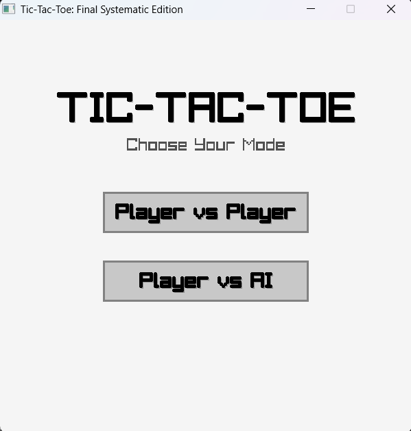

# 🎮 TicTacToe-God

**"Why play till the 9th move if we already know it's a draw?"**

## The Story Behind This Project
Honest story: I was playing Tic-Tac-Toe with my friend the other day, and we kept running into the same annoying issue. We would reach a point (maybe the 5th or 6th move) where we **knew** it was going to be a draw—no one could possibly win from there—but the game forced us to drag it out and fill all 9 boxes just to see the "Draw" message.

It felt like a waste of time. I thought, *"Why not make the code smart enough to realize it's a dead game before the board is even full?"*

So, I built the **Smart Draw** feature. Now, the game calculates every possible future outcome in real-time. If victory is mathematically impossible for both sides, it declares a Draw immediately. No more time wasting.

And since I am a **1st Year B.Tech AI/ML Student**, I couldn't stop there. I wanted to challenge myself, so I implemented the **Minimax Algorithm**—creating an AI opponent (God Mode) that looks into the future and is mathematically impossible to beat.

##  Key Features
* ** Smart Draw Detection:** The highlight of this project. It detects "dead games" early and ends them instantly instead of waiting for a full board.
* ** God Mode AI (Minimax):** A ruthless AI that calculates every single possibility. You can draw against it, but you cannot win.
* ** Clean GUI:** Built using **Raylib** in C (upgraded from a basic console version to a full graphical interface).

## How to Play
1.  Download the `game.exe` file from this repository.
2.  Double-click to run.
3.  Choose your mode:
    * **Player vs Player:** Play with a friend (with Smart Draw enabled).
    * **Player vs AI:** Try to survive against the God Mode AI.

##  Tech Stack
* **Language:** C
* **Library:** Raylib (for Graphics & Input)
* **Algorithm:** Minimax (Recursion)
